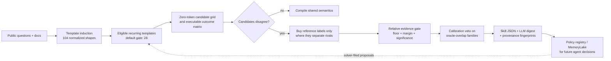
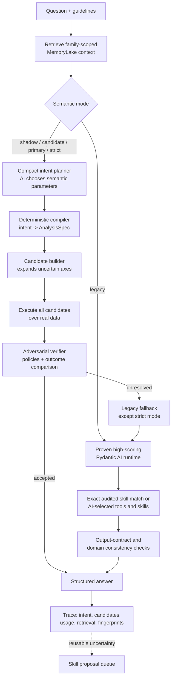

# DABStep MemoryLake Agent

**Learn semantics once. Let the model decide. Execute with evidence.**

A reproducible, AI-native data-analysis agent for the
[DABStep benchmark](https://huggingface.co/datasets/adyen/DABstep). The system
combines a high-performing Pydantic AI runtime with a semantic learning loop:
the model can select tools, propose reusable skills, express an analysis as a
compact typed intent, and delegate exact computation to deterministic
executors. MemoryLake provides the versioned knowledge plane behind the loop.

## Benchmark snapshot

| Evaluation | Easy | Hard | Overall |
| --- | ---: | ---: | ---: |
| **MemoryLake Agent**, full 450-task offline snapshot (2026-07-06) | **64/72 (90.28%)** | **350/378 (96.83%)** | **414/450 (95.78%)** |
| NVIDIA KGMon (NeMo Agent Toolkit) Data Explorer, validated leaderboard leader | 87.5% | 89.95% | leaderboard reports per split |

The 450-task snapshot was scored after inference against model-generated
reference answers; NVIDIA's result is the official
[validated leaderboard](https://huggingface.co/spaces/adyen/DABstep)
comparison. Together they place the complete-suite snapshot in a strong
competitive context, especially on the hard split. The release keeps the proven
runtime available as the default while adding the semantic compiler behind
explicit promotion modes. The complete learn -> freeze -> run -> report path
rebuilds the agent locally with no bundled answer assets.

## Why this architecture

DABStep's difficult questions are rarely difficult because pandas cannot
compute the result. They are difficult because a short question leaves several
plausible interpretations: population, denominator, wildcard matching,
aggregation grain, counterfactual scope, or output shape.

This project turns those choices into inspectable runtime objects:

- **AI-directed planning.** A model emits a small family-scoped semantic intent,
  chooses relevant learned policies, and can request the tools it needs.
- **Deterministic compilation.** The intent is compiled into a typed
  `AnalysisSpec` and executed over the benchmark data without asking the model
  to write the final calculation.
- **Adversarial verification.** Uncertain semantic axes expand into bounded
  rival candidates. A verifier compares executable outcomes before selecting an
  answer.
- **Reusable learned skills.** The solver can file skill proposals; the learn
  pipeline certifies reusable conventions as executable artifacts, which can
  also be rendered into an LLM-readable digest.
- **Versioned knowledge.** Public manuals, curriculum documents, and learned
  conventions are frozen into MemoryLake with content fingerprints.
- **Graceful promotion.** `legacy`, `shadow`, `candidate`, `primary`, and
  `strict` modes let the semantic path earn trust without sacrificing the
  established runtime.

The repository ships the mechanism. Benchmark data, model references, learned
skills, submissions, and local MemoryLake state are created by the reproduction
commands and remain outside the tracked tree.

## Four-stage reproduction

Install the project and configure `.env`:

```bash
git clone https://github.com/a1594834522-coder/memorylake-eval-dabstep.git
cd memorylake-eval-dabstep
python -m venv .venv && source .venv/bin/activate
pip install -e .
cp .env.example .env
```

Set `OPENAI_BASE_URL`, `OPENAI_API_KEY`, `DABSTEP_MODEL`, and
`MEMORYLAKE_API_KEY`. Then run the four stages:

```bash
dabstep-download-data && dabstep-agent learn --tasks tasks.json --data-dir context --official-dev tasks_dev.json --output artifacts/skills --resume
dabstep-agent freeze --docs data/context/manual.md data/context/payments-readme.md
dabstep-agent run --input tasks.json --data-dir context --output results/run.jsonl --run-mode memory-assisted --disable-memory-writes
dabstep-agent report --run results/run.jsonl --submission results/submission.jsonl
```

`learn` automatically runs the built-in skill audit. `freeze` creates or
reuses a MemoryLake project and writes its id to the ignored
`artifacts/freeze_state.json`; `run` reads that state automatically. All
expensive learn outputs are resumable with `--resume`.

## Learn: active semantics distillation

The public 450-task suite induces 104 normalized question templates. With the
default `--min-instances 5` gate, 28 recurring templates enter the main
certification pass; thin or unresolved templates remain available to the model
instead of becoming brittle deterministic routes.



The cost controls are structural:

1. Template induction and candidate execution use no model calls.
2. Candidate matrices are cached and reused across retries.
3. Budget mode labels only disagreement points and stops when more evidence
   cannot change the decision.
4. Full mode supports concurrent reference generation and targeted escalation.
5. `--from-proposals` lets the agent focus learn on templates it actually found
   valuable during solving.
6. `--resume` reuses persisted references, candidate matrices, and completed
   skills.

Every adopted artifact carries its template, declarative interpretation,
evidence summary, invariants, and document fingerprints. The same artifacts
can be rendered as `learned_conventions.md`, giving the LLM a compact
natural-language view so skills work both as deterministic executors and as
guidance for novel questions.

### Learn modes

| Mode | Behavior | Best use |
| --- | --- | --- |
| `--reference-mode full` | One reference solve per planned instance, with targeted escalation for ambiguous templates | Release certification |
| `--reference-mode budget` | Labels candidate disagreement points with early stopping | Fast iteration |
| `--reference <file>` | Reuses externally generated model references | Reproducible reruns |
| `--from-proposals <file>` | Certifies only solver-proposed public templates | Agent-directed continuous improvement |

## Runtime: model agency with deterministic execution



Promotion modes make this path operationally safe:

| Mode | Returned answer |
| --- | --- |
| `legacy` | Established runtime answer; default for benchmark reproduction |
| `shadow` | Established answer plus a complete semantic candidate trace |
| `candidate` | Verified semantic answer with automatic legacy fallback |
| `primary` | Same guarded semantic-first contract, reserved for staged promotion |
| `strict` | Certified semantic answer only; unresolved cases fail visibly |

The model owns semantic choice and tool use. Deterministic code owns data
execution, formatting, fingerprints, and safety gates. This keeps the agent
adaptive without making correctness depend on unrestricted generated code.

## MemoryLake knowledge plane

MemoryLake is the system of record for reusable domain knowledge:

- **Frozen assets.** Uploaded documents are hashed, enumerated, and attached to
  every runtime trace through an asset fingerprint.
- **Family-scoped retrieval.** Verbatim and family queries are filtered before
  whole chunks enter model context.
- **Skill consumption.** The LLM-readable convention digest can be frozen next
  to public manuals, while executable skill JSON remains locally auditable.
- **Evaluation isolation.** Official-style runs use read-only retrieval and
  disable memory writes.
- **Stateful reproduction.** `freeze` persists the project id locally so the
  following `run` command requires no manual copy/paste.

Retrieval failure is traceable and degrades to the non-memory path rather than
discarding the task.

## Trust and evaluation boundary

The learning system is designed around evidence, not self-certification:

- A candidate must beat executable rivals under the configured evidence gate.
- Skills overlapping the calibration oracle are recompiled and vetoed if they
  disagree on real instances.
- Out-of-oracle skills still require discrimination evidence, invariants, and
  provenance before adoption.
- Document drift is checked between `learn` and `freeze`.
- The release audit rejects tracked benchmark data, references, generated
  skills, submissions, model outputs, secrets, and private keys.
- Accepted or golden answers may be used only after inference for isolated
  scoring. They are not inputs to planning, prompts, skills, MemoryLake, or
  runtime execution.

## Configuration

| Variable | Purpose |
| --- | --- |
| `OPENAI_BASE_URL` / `OPENAI_API_KEY` | OpenAI-compatible solver endpoint |
| `DABSTEP_MODEL` | Main agent model |
| `DABSTEP_TEACHER_MODEL` | Optional separate reference/planner model |
| `DABSTEP_TEACHER_BASE_URL` / `DABSTEP_TEACHER_API_KEY` | Optional teacher endpoint |
| `MEMORYLAKE_API_KEY` | MemoryLake knowledge plane |
| `MEMORYLAKE_PROJECT_ID` | Optional; created and persisted by `freeze` |
| `DABSTEP_GENERATED_SKILLS` | `primary` (default) or `off` |
| `DABSTEP_GENERATED_SKILLS_DIR` | Learned artifacts, default `artifacts/skills` |
| `DABSTEP_SOLVE_TIMEOUT_SECONDS` | Per-reference solve timeout, default 600 |

Useful learn controls include `--reference-concurrency` (default 12),
`--concurrency` (template workers, default 4), `--adoption-floor`,
`--adoption-margin`, `--escalation-rounds`, `--max-templates`, and
`--resume`.

## Repository map

```text
src/dabstep_agent_pydantic/
|-- cli.py                       # learn / freeze / run / report
|-- workflow.py                  # established Pydantic AI runtime
|-- semantic_workflow.py         # promotion modes and fallback policy
|-- compact_semantic_planner.py  # family-scoped model intent
|-- intent_compiler.py           # intent -> typed AnalysisSpec
|-- candidate_builder.py         # bounded semantic rivals
|-- semantic_verifier.py         # candidate-level verification
|-- distill/                     # templates -> evidence -> skills
|-- memorylake.py                # knowledge retrieval
`-- runner.py                    # concurrent benchmark orchestration
scripts/
|-- skill_audit.py               # independent overlap audit
|-- semantic_shadow_eval.py      # representative promotion harness
`-- release_audit.py             # public-tree and secret audit
tests/                           # safety, runtime, compiler, and release tests
```

See [docs/architecture.md](docs/architecture.md) for runtime details and
[docs/semantics-distillation.md](docs/semantics-distillation.md) for the learn
protocol.
